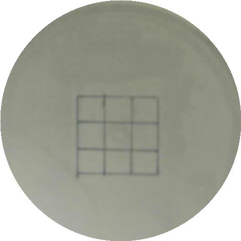
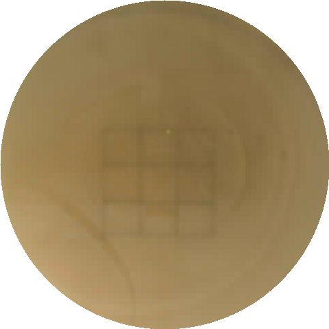
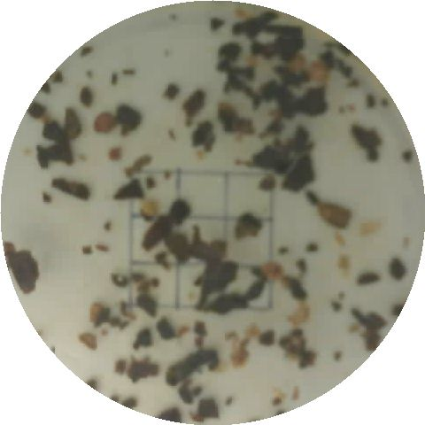
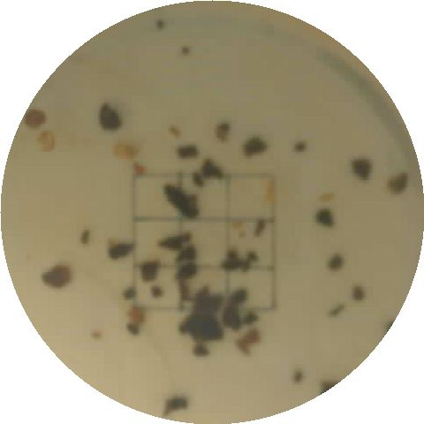
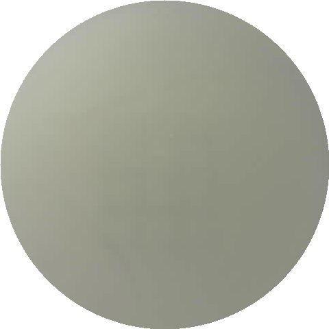
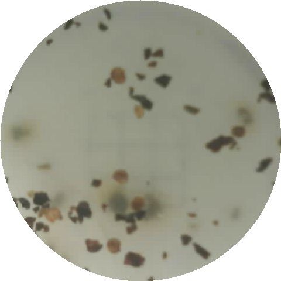
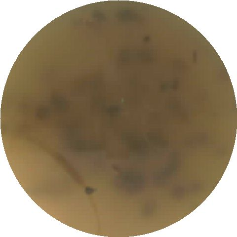

# AIoT Phase 2 — TinyML Waste Cooking Oil Quality Assessment

On-device TinyML system running on a **Freenove ESP32-S3-WROOM-1**. The device captures top-view images of a transparent oil container inside a closed cabinet, preprocesses them on-chip, and produces three independent contamination scores: **turbidity**, **particle**, and **colour**. It also forwards images to a cloud benchmark service so the on-device MobileNet predictions can be compared against a full-precision EfficientNet-B0 reference.

Phase 1 ran the device as a data-collection node, feeding a labelled training set into Google Drive through a FastAPI gateway. Phase 2 keeps the same hardware rig and adds three deployment paths:

- **Edge:** INT8-quantised MobileNet (V1 or V2) on the ESP32-S3 itself.
- **Cloud:** full-precision `.keras` models running on a host (`wco_phase_2/`).
- **Web client:** an Angular dashboard (`web_client/`) that drives all three paths and visualises results.

---

## Training dataset

The dataset has 296 hand-labelled JPEGs spread evenly across 2³ = 8 (turbidity, particle, colour) combinations, roughly 37 samples per bucket. Captures were collected through the Phase 1 pipeline (see [`wco_phase1/`](wco_phase1/README.md)) inside a closed cabinet under fixed white-LED lighting. Filenames encode the labels: `t{0|1}-p{0|1}-c{0|1}*.jpeg`.

One example per combination, drawn from [`training_data_samples/`](training_data_samples/):

| t | p | c | Reading | Sample |
|:-:|:-:|:-:|---|:-:|
| 0 | 0 | 0 | clean baseline, all three checks pass |  |
| 0 | 0 | 1 | colour darkened only |  |
| 0 | 1 | 0 | particulates only |  |
| 0 | 1 | 1 | particulates + darkened |  |
| 1 | 0 | 0 | turbid only |  |
| 1 | 0 | 1 | turbid + darkened | _sample not included in the public set_ |
| 1 | 1 | 0 | turbid + particulates |  |
| 1 | 1 | 1 | all three positive |  |

---

## Repository layout

```
AIoT_phase_2/
├── src/main.cpp                  # Firmware entry point + HTTP handlers
├── include/
│   ├── config.h                  # WiFi creds, server IPs, pins (do not commit)
│   ├── config.h.example          # Template
│   ├── board_config.h            # CAMERA_MODEL_ESP32S3_EYE selection
│   ├── camera_pins.h
│   ├── g_model_int8_data.h       # Header for the embedded model byte array
│   ├── MobileNetV1_a025.cpp      # TFLite INT8 weights for V1 (128×128, ~330 KB)
│   └── MobileNetV2_a035.cpp      # TFLite INT8 weights for V2 (160×160, ~770 KB)
├── lib/
│   ├── CameraManager/            # esp_camera init / capture / release
│   ├── LEDController/            # RGB LED via LEDC PWM
│   ├── UltrasonicSensor/         # HC-SR04 fill-level
│   ├── PreprocessService/        # JPEG decode → crop → circular mask → resize
│   └── InferenceService/         # TFLite-Micro interpreter, 3-head sigmoid output
├── platformio.ini                # Selects which model .cpp gets compiled
├── pipelines/                    # Colab notebooks (MobileNetV1, V2, EfficientNet-B0)
├── wco_phase1/                   # FastAPI data-collection gateway (Phase 1)
├── wco_phase_2/                  # FastAPI cloud inference + benchmark service
└── web_client/                   # Angular single-page dashboard
```

---

## Build & flash

This project uses **PlatformIO**. All commands assume `pio` is on your PATH.

The model variant is selected at build time via `build_src_filter` in `platformio.ini`:

```ini
build_src_filter = +<*> +<../include/MobileNetV2_a035.cpp>
```

Swap to `MobileNetV1_a025.cpp` to flash the smaller V1 model. Only one model is compiled in at a time, since both would exceed the available flash budget.

```bash
pio run                                     # Build
pio run --target upload                     # Flash
pio device monitor                          # Serial at 115200
pio run --target upload && pio device monitor
pio run --target clean
```

The target environment is `freenove_esp32s3`. Update `upload_port` in `platformio.ini` if your serial port differs.

---

## Configuration

Edit `include/config.h` before flashing (use `include/config.h.example` as a template):

- `WIFI_SSID`, `WIFI_PASSWORD`
- `SERVER_IP`, `SERVER_PORT` — the Phase 1 collection server in `wco_phase1/`
- `CLOUD_SERVER_IP`, `CLOUD_SERVER_PORT` — the Phase 2 cloud inference service in `wco_phase_2/`
- Pin assignments and LEDC channels

`config.h` is gitignored; do not commit credentials.

---

## HTTP endpoints (ESP32)

The firmware listens on port 80 with CORS open to the Angular client. Five GET endpoints share the same capture-and-preprocess pipeline. The returned JPEG body always carries the preprocessed image, and numeric results travel in `X-*` headers so the client reads everything in a single round-trip.

### `GET /snapshot?size=<px>`
Capture, preprocess to `size × size` JPEG (default 192). Returns the JPEG and `X-Fill-Percentage`.

### `GET /compute?size=<px>`
Edge inference path. Captures, preprocesses to the model's native input size (V1: 128, V2: 160; the `size` query is ignored when set, since the preprocessing has to match the model). Runs TFLite-Micro and returns the preprocessed JPEG plus:

- `X-Turbidity`, `X-Particle`, `X-Colour` — float scores in `[0, 1]`
- `X-Input-Size`, `X-Fill-Percentage`

### `GET /computeCloud?model=<name>&size=<px>`
Cloud inference path. Captures, preprocesses to `size × size` JPEG (default 480), forwards to `wco_phase_2`'s `/predict/{model_name}`, parses the response, and returns:

- `X-Model`, `X-Input-Size`, `X-Inference-Ms`
- `X-Turbidity`, `X-Particle`, `X-Colour`
- `X-Fill-Percentage`

`model` must be `EfficientNetB0`, `MobileNetV2`, or `MobileNetV1`.

### `GET /computeBenchmark?size=<px>`
Forwards to `wco_phase_2`'s `/benchmark`. Returns the full benchmark JSON (all 3 models, latency + RSS deltas) in `X-Benchmark-Results`, plus the preprocessed JPEG.

### `GET /uploadTrainingImage?turbidity=<0|1>&particle=<0|1>&color=<0|1>&size=<px>`
Phase 1 collection path. Captures, preprocesses, then POSTs a `multipart/form-data` payload (JPEG + label fields) to `wco_phase1`'s `/uploadGoogleDrive`. Returns the server's JSON response verbatim.

---

## Firmware libraries

| Library | Responsibility |
|---|---|
| `CameraManager` | Wraps `esp_camera` init, `capturePhoto()`, and release |
| `LEDController` | RGB LED via LEDC PWM on pins 19/20/21; `ledOn` / `ledOff` / `setColor` |
| `UltrasonicSensor` | HC-SR04 on TRIG=3 / ECHO=46; `getFillPercentage()` maps 17.5 cm (0%) to 3.5 cm (100%) |
| `PreprocessService` | `preprocessJpeg()` / `preprocessRgbAndJpeg()`: decode → crop 480×480 @ (362, 284) → circular mask (r=240, outside white) → bilinear resize → target size; all buffers via `ps_malloc` |
| `InferenceService` | `initInference()` / `runInference()`: loads the embedded model into a 500 KB TFLite arena; reads input size from the tensor at runtime; outputs three sigmoid scores ordered alphabetically by the TFLite converter as colour=0, particle=1, turbidity=2 |

---

## Companion services

| Service | Path | Role |
|---|---|---|
| Data collection | [`wco_phase1/`](wco_phase1/README.md) | FastAPI gateway that receives labelled JPEGs from `/uploadTrainingImage` and writes them to Google Drive |
| Cloud inference & benchmark | [`wco_phase_2/`](wco_phase_2/README.md) | FastAPI service hosting 3 full-precision `.keras` models for cloud-side prediction and head-to-head benchmarking |
| Web client | [`web_client/`](web_client/README.md) | Angular dashboard driving edge, cloud, and benchmark scenarios from one panel |
| Training pipelines | [`pipelines/`](pipelines/MODELS_EXPLAINED_TR.md) | Colab notebooks for MobileNetV1, MobileNetV2, EfficientNet-B0, plus a detailed Turkish walkthrough of preprocessing, training, and results |

---

## Key constraints

- **PSRAM required.** All large image buffers use `ps_malloc`. The board is built with `BOARD_HAS_PSRAM` and `qio_opi` memory type.
- The preprocess pipeline allocates three PSRAM buffers sequentially (raw RGB ~1.4 MB at 800×600, crop ~691 KB at 480×480, resized output ~110 KB at 192×192). Each buffer is freed before the next allocation.
- The TFLite tensor arena is 500 KB. `initInference()` tries internal SRAM first and falls back to PSRAM.
- `InferenceService` accesses MicroTFLite's global interpreter and input tensor via `extern`. Keep this in mind if upgrading `johnosbb/MicroTFLite`.
- EfficientNet-B0 is not deployed on-device. At ~5 MB and 224×224 input, both the flatbuffer and the activation memory exceed what the ESP32-S3 can allocate; it runs only in `wco_phase_2/` as a cloud-side accuracy reference.
